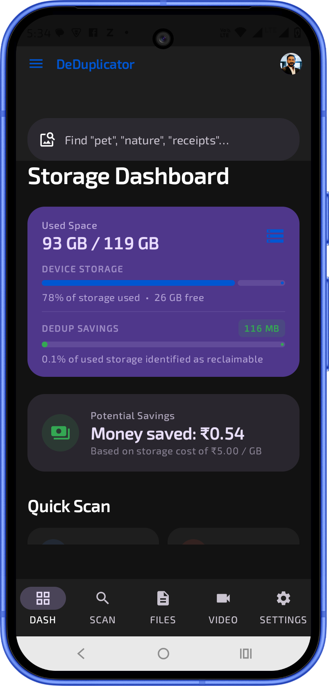
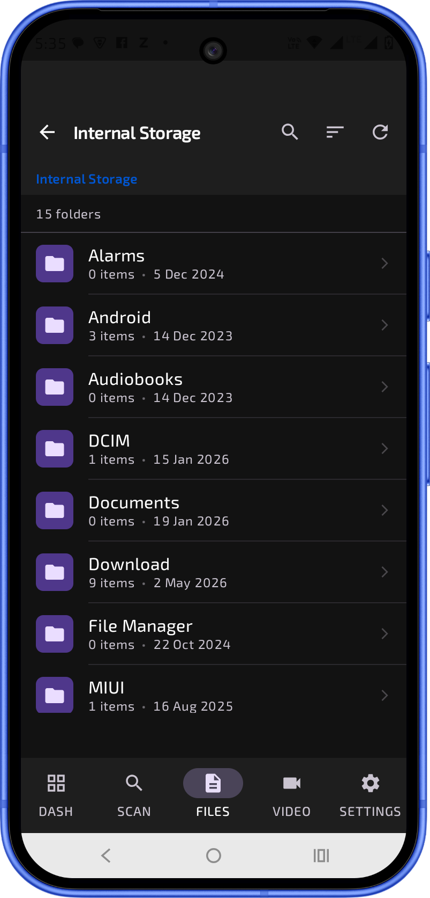
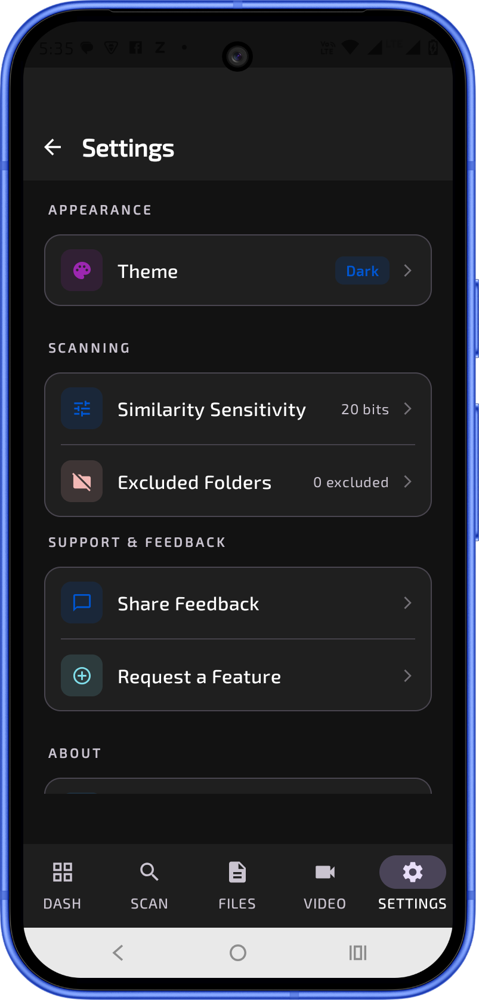
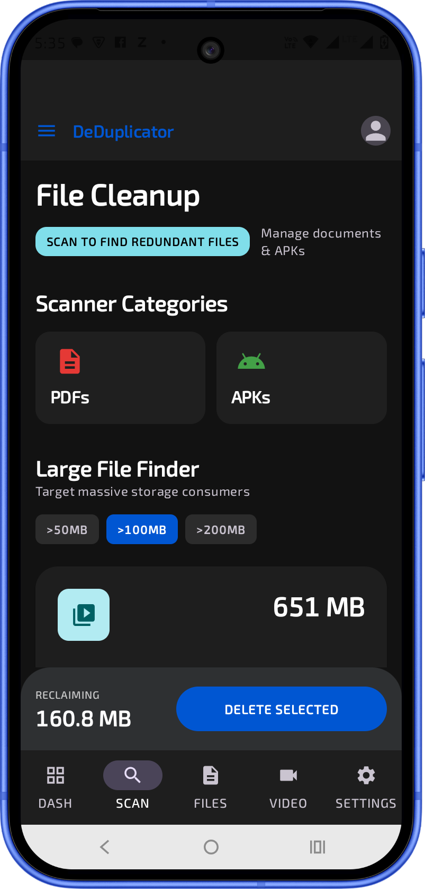
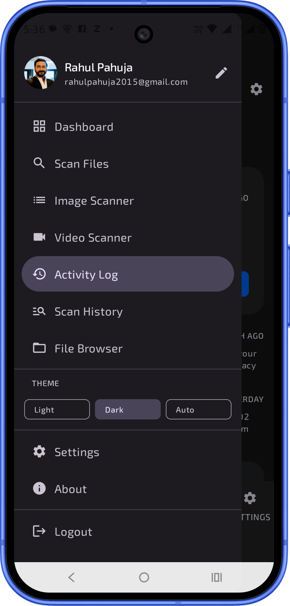

# Dedup

AI-powered duplicate cleaner for Android.

Dedup helps users identify and remove duplicate and unnecessary files using intelligent media analysis while keeping user data private and processed locally whenever possible.

---

## Screenshots

| Media Analysis | Storage Insights | Cleanup Results |
|---|---|---|
|  |  |  |  |  |

> Create a `screenshots` folder in the repository root and place your Play Store images inside it.

---

## Overview

Dedup helps clean:

- Duplicate photos
- Repeated videos
- Shared memes
- Old APK files
- Re-downloaded documents
- WhatsApp media clutter

It scans device storage and intelligently groups duplicate or similar files to recover storage safely and efficiently.

---

## Features

| Category | Capabilities |
|---|---|
| Media Deduplication | Duplicate image, video, PDF, and APK detection |
| Smart Cleaning | WhatsApp junk cleanup, meme detection, download cleanup |
| Intelligent Analysis | Exact duplicate detection, metadata matching, media fingerprinting |
| Privacy First | Local-first processing, no unnecessary cloud uploads |

---

## Platform Support

| Current | Planned |
|---|---|
| Android | iOS |
|  | Desktop platforms |
|  | Cloud integrations |

---

## Technology Stack

| Layer | Technologies |
|---|---|
| Language | Kotlin |
| Framework | Android SDK |
| Architecture | Jetpack Components |
| Concurrency | Coroutines |
| Storage | Room Database |
| Media Access | MediaStore APIs |

---

## Installation

This repository is private and proprietary.

Access is currently limited to authorized testers and collaborators only.

---

## Early Access Testing

For becoming a part of the early testing group, please fill out the registration form shared by the repository owner.

---

## Project Status

Dedup is under active development. Features, APIs, and internal implementations may change during the preview phase.

---

## Intellectual Property Notice

Copyright © 2026 Rahul Pahuja. All rights reserved.

This repository, source code, architecture, assets, branding, algorithms, and associated materials are proprietary intellectual property owned by Rahul Pahuja.

Unauthorized copying, modification, redistribution, sublicensing, resale, reverse engineering, public distribution, or commercial usage of this software, in whole or in part, is strictly prohibited without explicit written permission from the owner.

Access to this repository does not grant permission to reproduce, replicate, or create derivative works from the software.

---

## Contributing

Contributions, suggestions, and issue reports are welcome.

By contributing to this repository, you agree that all contributions become part of the proprietary project owned by the repository owner.

---

## Author

| Name | Role |
|---|---|
| Rahul Pahuja | Staff Software Engineer · Mobile Architect · Founder, Mobile1X |

---

## Contact

For licensing, collaboration, partnership, or commercial inquiries, please contact the repository owner directly.
